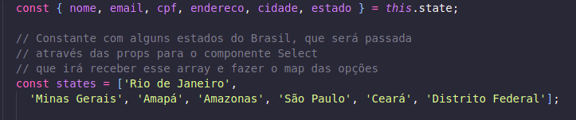
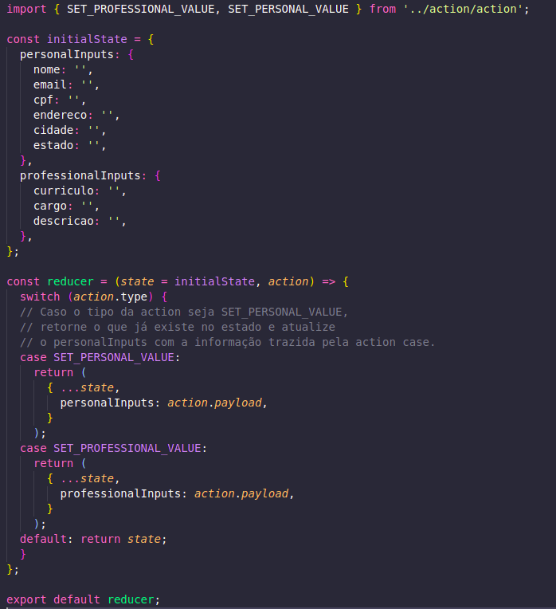
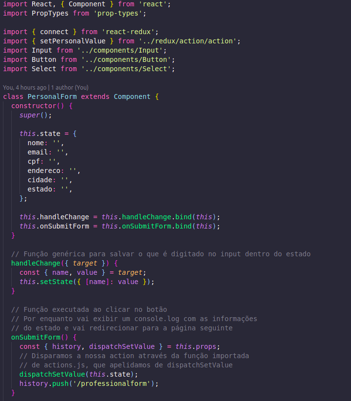

# Exercício de fixação
Vamos criar formulários utilizando `Redux`! \o/

Vocês criarão dois formulários, cada um em uma etapa, um para dados pessoais e outro para dados profissionais e exibí-los na tela.


Para isso, é preciso salvar as informações de cada formulário no gerenciador de estados e, por fim, numa outra página, acessar esses dados para que sejam renderizados.

Você vai precisar de:

* Três páginas: uma vai renderizar o formulário de informações pessoais, outra de informações profissionais e uma para exibir as informações, além de um botão junto dos formulários que enviam as informações e passam para a página seguinte.

* Gerenciador de estados (Reeeedux), para salvar as informações na `store` e também para acessá-las.

Então, mãos ao código!

**1 - Crie uma pasta chamada `pages`, e, dentro dela, 3 arquivos:**

PersonalForm.jsx
ProfessionalForm.jsx
FormDataDisplay.jsx

_Se vocês quiserem utilizar a extensão .js, tudo bem, fiquem à vontade!_

Não se preocupe com o conteúdo de cada uma delas, por enquanto renderize apenas uma `div` com um texto identificando cada uma das páginas.

**2 - Crie as rotas dentro de `App.js` para renderizar as páginas:**

`PersonalForm` será renderizada na página principal, com a rota `'/'`.
`ProfessionalForm` será renderizada ao acessar a rota `'/professionalForm'`.
`FormDataDisplay` será renderizada ao acessar a rota `'/formDisplay'`.

**3 - Crie um `fieldset` que contenha os seguintes `inputs` e os renderize em `PersonalForm.js`:**

Nome - Texto
Email - Texto
CPF - Texto
Endereço - Texto
Cidade - Texto
Estado - Select
Todos os estados do Brasil
Um botão com o texto `Enviar` e que redireciona para a página ProfessionalForm

**4 - Crie um `fieldset` que contenha os seguintes inputs e os renderize em `ProfessionalForm.js`:**

Resumo do currículo - TextArea
Cargo - TextArea
Descrição do cargo - Texto
Um botão com o texto `Enviar` e que redireciona para a página FormDataDisplay

**5 - Crie um diretório chamado Redux:**

Dentro da pasta "redux", crie as pastas "actions", "reducers" e "store".
Dentro de "actions" crie um arquivo chamado `action.jsx`.
Dentro de "reducers" crie um arquivo chamado `reducers`
Dentro de "store" crie um arquivo chamado `store`.

_Lembre-se que, ao montar a estrutura do Redux, é preciso importar o `Provider`, que recebe a `store`, no `index.js`._

**Dica: Caso esteja tendo dificuldades para montar a estrutura do Redux, você pode consultar o passo a passo que estão nesse [link!](https://app.betrybe.com/course/front-end/gerenciamento-de-estado-com-redux/usando-o-redux-no-react/a2dac445-434c-4690-83da-7ebef1aad2cd/conteudos/2036e927-303a-4846-a741-80dbe155266d/fluxo-de-dados-no-redux/f07a7c11-2049-4c2f-b514-3db84cb40ae7?use_case=side_bar)

**6 - Salve as informações das páginas `PersonalForm` e `ProfessionalForm` na `store`.**

**Dica: Lembre-se que o `mapStateToProps` lê as informações da `store` e o `mapDispatchToProps` envia as informações para a `store`.**

**7 - Renderize, em `FormDataDisplay`, todas as informações que estão salvas na `store`.**

---

# Exercício de fixação - Gabarito

Vamos criar formulários utilizando `Redux`! \o/

Vamos por partes!

Primeiramente, é necessário criar e inicializar a aplicação para que possamos visualizá-la rodando no navegador. Utilize os seguintes comandos: `npx create-react-app my-form-redux && cd my-form-redux && npm start`.

Agora, precisamos analisar os exercícios:

## **1 - Crie uma pasta chamada pages, e, dentro dela, 3 arquivos:**

* PersonalForm.jsx
* ProfessionalForm.jsx
* FormDataDisplay.jsx

Se vocês quiserem utilizar a extensão .js, tudo bem, fiquem à vontade!

Não se preocupe com o conteúdo de cada uma delas, por enquanto renderize apenas uma `div` com um texto identificando cada uma das páginas.

Então vamos lá!

## Resolução exercício 1:

Precisamos criar cada uma das páginas dentro de uma pasta chamada `pages`. Essa pasta ficará dentro de `src` e como pede para não nos preocuparmos, por enquanto, com o conteúdo, vamos colocar apenas um texto com o nome da página.

* PersonalForms.jsx

 

* ProfessionalForm.jsx


* Form-data-display.jsx


Com as páginas criadas, precisamos testar para ver se estão funcionando, sendo assim, podemos seguir para o exercício 2, que pede para criarmos as rotas.

## **2 - Crie as rotas dentro de `App.js` para renderizar as páginas:**

* `PersonalForm` será renderizada na página principal, com a rota `'/'`.
* `ProfessionalForm` será renderizada ao acessar a rota `'/professionalform'`.
* `FormDataDisplay` será renderizada ao acessar a rota `'/formdisplay'`.

## Resolução exercício 2:
Aqui vamos passar o nosso componente App.js para classe, mantendo o padrão do nosso código e agora que temos nossa estrutura de páginas pronta, podemos partir para o próximo passo, a criação das rotas! Mas antes, é necessário instalar o `react-router-dom` com o comando: `npm install react-router-dom`

Precisamos importar o `BrowserRouter`, o `Route` e o `Switch` e renderizar a página para cada uma das rotas.
* App.js


Teste as rotas para ver se estão renderizando o conteúdo correto e então, vamos partir para o exercício 3!

## **3 - Crie um `fieldset` que contenha os seguintes inputs e os renderize em `PersonalForm.jsx`:**

* Nome - Texto
* Email - Texto
* CPF - Texto
* Endereço - Texto
* Cidade - Texto
* Estado - Select
* Todos os estados do Brasil
* Um botão com o texto Enviar e que redireciona para a página ProfessionalForm

## Resolução exercício 3:

Agora, precisamos renderizar os componentes dentro de `PersonalForms`. Analisando o formulário precisamos de um input para o `nome`, `email`, `CPF`, `endereço` e `cidade`. Como esses inputs possuem a mesma estrutura, podemos fazer o que?

Componentizar! \o/

Calma! Não esquecemos do `select` e nem do `button`, vamos componentizá-los também!

Dentro de `src` vamos criar a pasta `components` e dentro dela, os nossos componentes de `Input` e o `Select`.

* Componenete Input


* Componente Select


* Componente Button


Agora que os componentes da página `PersonalForm` estão prontos, podemos estruturá-la, salvando o que a pessoa usuária digita no estado do componente:


Dentro do render, chamaremos os nossos estados, desconstruindo-os e iremos atribuir também alguns estados brasileiros em seu devido state:



Em seguida, precisamos retornar o os componentes recebendo nas `props` seus devidos states e funções.

```javascript
return (
  <fieldset>
    <Input
      label="nome: "
      type="text"
      onChange={ this.handleChange }
      value={ nome }
      name="nome"
      required
    />
    <Input
      label="email: "
      type="text"
      onChange={ this.handleChange }
      value={ email }
      name="email"
      required
    />
    <Input
      label="cpf: "
      type="text"
      onChange={ this.handleChange }
      value={ cpf }
      name="cpf"
      required
    />
    <Input
      label="endereco: "
      type="text"
      onChange={ this.handleChange }
      value={ endereco }
      name="endereco"
      required
    />
    <Input
      label="cidade: "
      type="text"
      onChange={ this.handleChange }
      name="cidade"
      value={ cidade }
    />
    <Select
      defaultOption="Selecione"
      onChange={ this.handleChange }
      value={ estado }
      label="Estado: "
      id="estado"
      name="estado"
      options={ states }
    />
    <Button type="button" label="Enviar" onClick={ this.onSubmitForm } />
  </fieldset>
);

PersonalForm.propTypes = {
  history: PropTypes.shape({
    push: PropTypes.func.isRequired,
  }).isRequired,
};

export default PersonalForm;
```
O quarto exercício pede para criarmos outro `fieldset`, mas agora em `ProfessionalForm`.

## **4 - Crie um `fieldset` que contenha os seguintes inputs e os renderize em `ProfessionalForm.jsx`:**

* Resumo do currículo - TextArea
* Cargo - TextArea
* Descrição do cargo - Texto

## Resolução exercício 4:

Observando bem, temos dois componentes com a mesma estrutura, o `Resumo do currículo` e o `Cargo` vão ser `textarea`, ou seja...

Componetizar! \o/

* Componente TextArea


Pronto, componentes feitos! \o\

_**PS: Pra nossa sorte, a `Descrição do cargo` é um `input` do tipo texto e já temos esse componente, além de já ter também o componente de botão, que vai nos levar para a página `FormDataDisplay`.**_

Agora precisamos montar a estrutura da página:


Temos nossa estrutura, temos nossas rotas e agora chegou o momento mais esperado, a aplicação do Redux, yaaaay \o/! Antes de tudo, precisamos instalar o `react-redux`. Para isso, utilizamos o comando: `npm install redux react-redux`.

Feita a instalação, vamos para o que interessa, O CÓDIGO!

O exercício 5 diz:

## **5 - Crie um diretório chamado `Redux`:**

* Dentro da pasta "redux", crie as pastas "actions", "reducers" e "store".
* Dentro de "actions" crie um arquivo chamado `action.js`.
* Dentro de "reducers" crie um arquivo chamado `reducers.js`.
* Dentro de "store" crie um arquivo chamado `store.js`.

**Lembre-se que, ao montar a estrutura do Redux, é preciso importar o Provider, que recebe a store, no index.js.**

## Resolução exercício 5:

Primeiro, vamos montar a estrutura do Redux e aos poucos vamos complementando com as informações necessárias.

* Crie uma pasta chamada "redux".

* Dentro da pasta "redux", crie as pastas: "store", "reducer" e "actions".

* Dentro da pasta "store", crie um arquivo `store.js`.

* Dentro da pasta "reducer" crie um arquivo reducer.js e outro arquivo `index.js` para utilizarmos o `combineReducers`.

* Dentro da pasta "actions" crie um arquivo chamado `actions.js`.

O `reducer` será responsável pela manipulação da `store` de acordo com as `actions` que vai receber. A estrutura do `reducer` consiste em ter o estado inicial do formulário `PersonalForm` e do `ProfessionalForm`, lembrando que:

* O `PersonalForm` contém as informações relativas à: `nome`, `email`, `cpf`, `endereço`, `cidade` e `estado`.

* O `ProfessionalForm` contém as informações relativas à: `currículo`, `cargo` e `descrição`.

Como ainda não temos as nossas actions e nem o que cada uma delas irá fazer, criremos o nosso `reducer` com o switch apenas com o default. Mais pra frente iremos complementá-lo.


Todo estado de sua aplicação será armazenado pela store. Ela executada a partir da função `createStore()` que recebe dois parâmetros:

1. O primeiro parâmetro vai receber nosso `reducer`. Lembrando que quando temos mais de um `reducer` precisamos unir os `reducers`, para isso, no arquivo index.js, vamos colocar todos os `reducers` da aplicação e combiná-los atráves da função `combineReducers()`. É através dessa função que a `store` tem acesso a todos os estados manipulados. Na nossa aplicação, vamos utilizar apenas um `reducer`, mas é bom já deixarmos estruturado.


2. O segundo parâmetro vai ser o `composeWithDevTools()` que irá permitir a visualização dos seus estados no Redux pelo navegador com a [extensão](https://chrome.google.com/webstore/detail/redux-devtools/lmhkpmbekcpmknklioeibfkpmmfibljd?hl=pt-BR) `Redux Devtools` e para conectá-lo na aplicação, basta instalar utilizar a seguinte linha de comando `npm i redux-devtools-extension`.

**_OBS: Se a extensão Redux Devtools não estiver instalada, a linha de configuração dela apresentará um erro no navegador._**


Antes de criar as nossas `actions`, vamos importar a nossa `store` e o `Provider` dentro do `index.js` na raíz da nossa aplicação.


Atualize seu navegador e perceba que agora a extensão está ativada  redux devtools e você consegue visualizar os estados da sua store na aba state.


Agora, precisamos implementar as nossas `actions`!

As `actions` são objetos javascript responsáveis por levar a informação para o nosso reducer, se comunicando através do `type`. Mas como disparamos essas `actions`? Ou seja, como disparamos esse objeto? Fazemos isso através de uma função, essa função é chamada de `action creator` e que retorna um objeto, ou seja, nossa `action`.

Vamos criar as `action creators` e cada uma delas será responsável por carregar (ou não) uma informação (payload) para atualizar a `store` e, obrigatoriamente um `type`, que é o tipo da nossa `action`:


Note que utilizamos o `export const` nas variáveis com os tipos das `actions`, pois vamos importá-las no nosso `reducer` e, salvando em uma variável, garantimos a consistência do nosso código e nos ajuda a dar manutenção, pois, caso a gente precise mudar o tipo da action, alteramos apenas em um lugar e no restante, alteramos a variável e se a gente esquecer de alterar a variável em algum lugar, nosso código quebra.

Não podemos esquecer agora do nosso `reducer`:



Pronto, toda a estrutura do nosso `Redux` está pronta, agora precisamos capturar os estados das nossas páginas `PersonalForm` e `ProfessionalForm`, salvá-las na `store`. Ao acessar a página `FormDataDisplay`, precisamos recuperar essas informações da `store` e exibí-las na tela, como pede o exercício 6:

## **6 - Salve as informações das páginas `PersonalForm` e `ProfessionalForm` na `store`.**

**_Dica: Lembre-se que o `mapStateToProps` lê as informações da `store` e o `mapDispatchToProps` envia as informações para a `store`._**

## Resolução exercício 6:

No componente PersonalForm, vamos importar a função responsável por despachar a `action` que vai carregar o type `SET_PERSONAL_VALUE`, a função que retorna essa `action` está dentro do arquivo `action.js` e é chamada `setPersonalValue`.

Mas, para poder enviar informações para a nossa `store`, precisamos informar que vamos despachar essa ação, então, pra isso, precisamos utilizar o `mapDispatchToProps` e "apelidamos" a nossa função `setPersonalValue` de `dispatchSetValue`.

* PersonalForm.jsx




Vamos fazer praticamente a mesma coisa na `ProfessionalForm`, mas importando a função `action creator` correspondente.

* ProfessionalForm.jsx


E por último, o exercício 7! \o\

## **7 - Renderize, em `FormDataDisplay`, todas as informações que estão salvas na `store`.**

## Resolução exercício 7:


Você percebeu que estamos repetindo o mesmo código várias vezes? O que podemos fazer quando isso acontece?

Componetizar! \o/

Mas agora, vamos deixar com você! ;)

**Dicas**:

Se você quiser, pode criar uma pasta para cada um dos componentes, dessa forma, ao criar o `css` para cada componente, eles ficam separados em pastas. Ex: components/ Input/ Input.js Input.css

Você também pode criar um arquivo index dentro da sua pasta `components` e dentro da sua pasta `pages`, para fazer o export default de cada um dos componentes.

Exemplo:

``` javascript
 // components/index.js

export { default as Input } from './Input'; export { default as Button } from './Button';

```

E dentro dos seus componentes, importar assim:

``` javascript

 import { Input, Button } from '../components';

 ```
